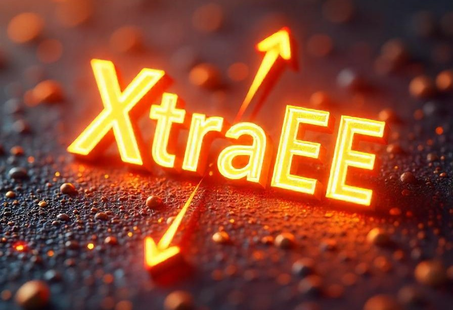

# XtraEE

XtraEE is a quantum chemistry tool designed to analyze excited-state calculations, providing a comprehensive comparison between different methods such as CCSD and CIS. It calculates transition amplitudes, accuracy, and provides insights into the similarity between excited states.


<div align="center">
  
</div>

Table of Contents
=================
<!--ts-->
* [What does this program do?](#what-does-this-program-do)
* [What is necessary to use it?](#what-is-necessary-to-use-it)
* [How to install it?](#how-to-install-it)
* [How to use it?](#how-to-use-it)
  
<!--te-->
    
## What does this program do?

1. This program collects data from excited-state calculations:

| **From EOM-CCSD**                                | **From CIS**                                     |
| :----------------------------------------: | :----------------------------------------: |
|               State type (singlet or triplet)            |               State type (singlet or triplet)            |
|                     State number                               |                     State number                               |
|              Excitation energy                          |              Excitation energy                          |
|           Transition between orbitals                |           Transition between orbitals                |
|              Transition amplitude                       |              Transition amplitude                       |
|              Oscillator strength                        |              Oscillator strength                        |
|     $R_0^2$, $R_1^2$, and $R_2^2$ values       |                                            |
|               Omega or Mulliken value                    |                                            |

2. It matches the transitions between orbitals of the two states and utilizes the matched transition's amplitudes (denoted as $a_i$ for State 1 and $b_i$ for State 2) in the equation below to calculate an accuracy value. This accuracy value, ranging between 0 and 1, provides a quantitative measure of the degree of correspondence between the two states.

$$Accuracy = \sum_i{a_i b_i}$$
  
3. It prints the relevant data into separate files for further analysis.

## What is necessary to use it?

The excited-state calculations must be performed using the **QChem** quantum chemistry software for EOM-CCSD and CIS methodology.

## How to install it?

Clone the repository to your local machine using the following command:

```bash
git clone git@github.com:dpooria/xtraee
```

Navigate to the xtraee directory and install the package:

```bash
pip install .
```

## How to use it?

1. Navigate to the directory containing the output files from the excited-state calculations, ensuring they are easily accessible.

2. To compare two specific states, execute the following command in the terminal:
   
   ```bash
   xtraee  --input-cis /../address_to_cis_file/cis_output.log --input-ccsd /../address_to_ccsd_file/ccsd_output.log compare method_name:1_state_name-1_state_number method_name:2_state_name-2_state_number
   ```

    - method_name: Specify the method (e.g, `CCSD` or `CIS`).
    - state_name: Specify the state type (e.g, `singlet` or `triplet`).
    - state_number: Use the state numbering convention from the `.log` file.
      * For `CCSD`, use the `state_number/A`
      * For `CIS`, use the `state_number/`

4. The program outputs three key values to the terminal:

    - **Accuracy:** Quantifies the similarity between the two states, representing the extent to which they correspond to each other.
    
    - **Error:** Represents the degree of dissimilarity between the two states.
    
    - **Fraction Matched:** Indicates the fraction of transitions in State 1 that are matched to those in State 2, using State 1 as the reference.

5. It generates five key output files::
  
  - **`first_kid_cis.txt`:** Contains the data described above for all states calculated using the CIS method.
  
  - **`first_kid_ccsd.txt`:** Contains the data described above for all states calculated using the CCSD method.

  - **`happy_family_cis.txt`:**  Lists all CIS singlet states along with their corresponding matched CIS triplet states, based on the type of transition between orbitals.

  - **`happy_family_ccsd.txt`:**  Lists all CCSD singlet states along with their corresponding matched CCSD triplet states, based on the type of transition between orbitals.

  - **`sad_family.txt`:** Combines matched states from both methods, pairing CCSD singlets with all possible matched CIS singlets, and CCSD triplets with all possible matched CIS triplets, using CCSD states as the reference.
    
  ### Example:
  
  For comparing the first singlet of CCSD with third singlet of CIS

  ```bash
  xtraee  --input-cis /../address_to_cis_file/cis_output.log --input-ccsd /../address_to_ccsd_file/ccsd_output.log compare CCSD:singlet-1/A CIS:singlet-3/
```

  This will output the following:
  
  ```log
Comparing singlet-1/A and singlet-3/
  
  accuracy  | error | fraction matched
  
  0.9660054368892956|     0.033994563110704416|   1.0
```

5. To perform a comprehensive comparison of all states, run the following command in the terminal:

   ```bash
   xtraee  --input-cis /../address_to_cis_file/cis_output.log --input-ccsd /../address_to_ccsd_file/ccsd_output.log compareall
   ```

   This will generate four additional output files, alongside the existing ones:

   - **`singlet_triplet_compare_cis.csv`:** Contains the accuracy values for all CIS states, where the CIS singlet is designated as state 1 and the CIS triplets as state 2.
  
   - **`A_A_compare_ccsd.csv`:** Contains the accuracy values for all CCSD states, where the CCSD singlet is designated as state 1 and the CCSD triplets as state 2.
  
   - **`CIS_singlet_CCSD_A_compare_ccsd_vs_cis.csv`:** Contains the accuracy values for all singlet states, comparing CCSD's singlet (state 1) with CIS's singlet (state 2).
  
   - **`CIS_triplet_CCSD_A_compare_ccsd_vs_cis.csv`:** Contains the accuracy values for all triplet states, comparing CCSD's triplet (state 1) with CIS's triplet (state 2).


